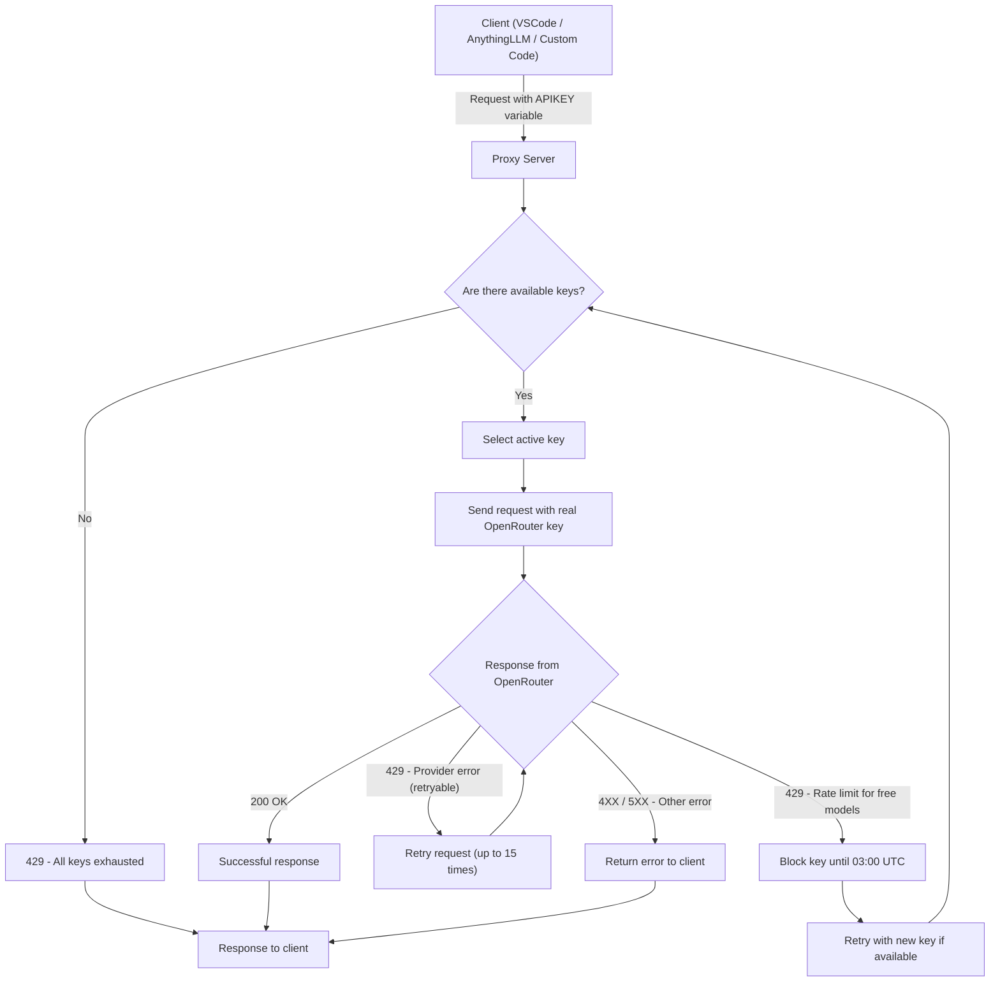

# OpenRouter Key Proxy

Промежуточный прокси-сервер для ротации ключей OpenRouter с автоматическим обходом ограничений частоты запросов.

Помогает справится с раздражающими ситуациями когда при выполнении Agentic задач мы получаем от Openrouter upstream 429 Rate limit ломающие наши Agent flow или просто отнимающие время.

## Техническая реализация

Схема

## Основные сценарии использования
- Единый сервер для управления различными учетными записями и API ключами (бесплатные, с 10$ кредитом, платные)
- Использование набора прокси серверов для обращения к Openrouter, при необходимости (функционал в планах на разработку)
- Случайное или последовательное использование API ключей, в зависимости от требований к запросам

## Примеры настройки различных решений

### VSCode Continue

### LobeChat

### Custom Agentic Code

### AnythingLLM

## Запуск и настройка
