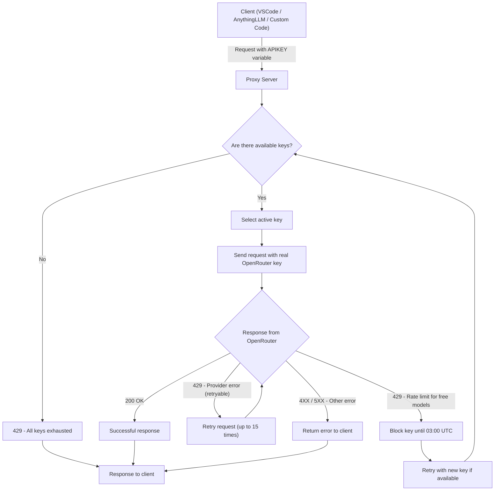

<b>Openrouter-Proxy-Injector:</b> Управление API ключами Openrouter для случаев с высокой нагрузкой. 
Умный прокси-сервер для ротации ключей OpenRouter с автоматизированным смягчением ограничений скорости от вышестоящего сервера.

# Multilanguage Readme

# Обзор сервиса
Openrouter proxy injector позволяет вам запускать и управлять API ключами Openrouter как для DEV, так и для PRODUCTION окружений, а также отслеживать и обрабатывать ограничения скорости от вышестоящих провайдеров как для платных, так и для бесплатных моделей.
Он идеально подходит для Vibe coding, интенсивного использования AI агентами или просто разработки с использованием Openrouter API.
# Возможности
- Использование различных ключей API для выставления счетов вашей группе агентов.
- Управление лимитами запросов в 50 запросов в день для каждой учетной записи API, что позволяет неограниченно использовать бесплатные модели через несколько учетных записей.
- Автоматически повторять запросы, пока не будет получен ответ от вышестоящей модели при достижении ограничений сервиса (например, частые ограничения скорости 429 Google Gemini во время интенсивного использования агентом)
- Поддержка всех методов Openrouter API для взаимодействия с моделями как есть
- Обработка потоковых и не потоковых запросов с обработкой лимита скорости 429
- Учитывает лимит повторных попыток в минуту для Openrouter API.
# Технические детали

## Техническая архитектура

# Параметры конфигурации приложения
|ENV variable|Type|Required|Default|Description|
|------------|----|--------|-------|-----------|
|PROXY_API_KEY|String|True|EMPTY|Ваш собственный унифицированный ключ API для обработки ваших запросов|
|OPENROUTER_KEYS|String|True|EMPTY|Ключи API Openrouter. Например, `OPENROUTER_KEYS=sk...ab,sk...cd` и так далее|
|TIMEZONE|String|False|UTC|Временная зона для обработки ежедневных лимитов использования API для бесплатных моделей. Используется для сброса ограниченных и заблокированных ключей.|
|UVICORN_PORT|Int|False|9999|Default app port to listen|
|UVICORN_HOST|Int|False|0.0.0.0|Default app ip to listen|
|UVICORN_LOG_LEVEL|String|False|info|Установите уровень ведения журнала. Например, debug для отображения сведений о запросах, включая тело и ответы. API ключи OpenRouter запутываются в отладочных журналах.
# Быстрый старт с Docker
1. [Установите](https://docs.docker.com/engine/install/) Docker engine
2. Запустите контейнер `docker run -it -e PROXY_API_KEY=<RANDOM_UNIQE_STRONG_KEY> -e OPENROUTER_KEYS=sk...ab,sk...cd -p 9999:9999 ghcr.io/serjs/openrouter-proxy-injector:latest`
3. Установите OpenRouter API URL как ваш docker host URL, например, http://<docker_host_ip>:9999
4. Вот и все
5. Проверьте API Openrouter Proxy Injector и статусы ключей
[http://<docker_host_ip>:9999/docs](http://<docker_host_ip>:9999/docs)
[http://<docker_host_ip>:9999/docs#/default/get_key_status_key_status_get](http://<docker_host_ip>:9999/docs#/default/get_key_status_key_status_get)
# Быстрый старт с docker-compose
1. Скопируйте и отредактируйте .env `cp .end.sample .env`
Заполните `PROXY_API_KEY` и `OPENROUTER_KEYS` в качестве минимальных обязательных параметров
2. Запустите `docker compose up -d`
4. Вот и все
5. Проверьте API Openrouter Proxy Injector и статусы ключей
[http://<docker_host_ip>:9999/docs](http://<docker_host_ip>:9999/docs)
[http://<docker_host_ip>:9999/docs#/default/get_key_status_key_status_get](http://<docker_host_ip>:9999/docs#/default/get_key_status_key_status_get)
# Примеры для различных продуктов
## VSCode Continue
## LobeChat
## Custom Agentic Code
## AnythingLLM
